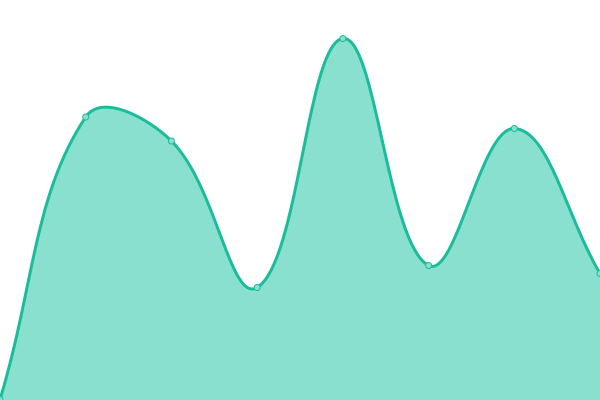

# [📈 Live Status](https://status.beta.explorer.cardano.org): <!--live status--> **🟧 Partial outage**

This repository contains the open-source uptime monitor and status page for [Cardano Foundation](https://cardanofoundation.org), powered by [Upptime](https://github.com/upptime/upptime).

With [Upptime](https://upptime.js.org), you can get your own unlimited and free uptime monitor and status page, powered entirely by a GitHub repository. We use [Issues](https://github.com/cardano-foundation/cf-explorer-status/issues) as incident reports, [Actions](https://github.com/cardano-foundation/cf-explorer-status/actions) as uptime monitors, and [Pages](https://status.beta.explorer.cardano.org) for the status page.

<!--start: status pages-->
<!-- This summary is generated by Upptime (https://github.com/upptime/upptime) -->
<!-- Do not edit this manually, your changes will be overwritten -->
<!-- prettier-ignore -->
| URL | Status | History | Response Time | Uptime |
| --- | ------ | ------- | ------------- | ------ |
|  [beta.explorer.cardano.org (mainnet frontend)](https://beta.explorer.cardano.org/) | 🟩 Up | [beta-explorer-cardano-org-mainnet-frontend.yml](https://github.com/cardano-foundation/cf-explorer-status/commits/HEAD/history/beta-explorer-cardano-org-mainnet-frontend.yml) | 

 227ms
     
 | 

<a href="https://status.beta.explorer.cardano.org/history/beta-explorer-cardano-org-mainnet-frontend">100.00%</a>
    

|  [preprod.beta.explorer.cardano.org (preprod frontend)](https://preprod.beta.explorer.cardano.org/) | 🟩 Up | [preprod-beta-explorer-cardano-org-preprod-frontend.yml](https://github.com/cardano-foundation/cf-explorer-status/commits/HEAD/history/preprod-beta-explorer-cardano-org-preprod-frontend.yml) | 

 278ms
     
 | 

<a href="https://status.beta.explorer.cardano.org/history/preprod-beta-explorer-cardano-org-preprod-frontend">100.00%</a>
    

|  [preview.beta.explorer.cardano.org (preview frontend)](https://preview.beta.explorer.cardano.org/) | 🟩 Up | [preview-beta-explorer-cardano-org-preview-frontend.yml](https://github.com/cardano-foundation/cf-explorer-status/commits/HEAD/history/preview-beta-explorer-cardano-org-preview-frontend.yml) | 

 318ms
     
 | 

<a href="https://status.beta.explorer.cardano.org/history/preview-beta-explorer-cardano-org-preview-frontend">99.93%</a>
    

|  [mainnet - API](https://api.beta.explorer.cardano.org/api/v1/epochs) | 🟥 Down | [mainnet-api.yml](https://github.com/cardano-foundation/cf-explorer-status/commits/HEAD/history/mainnet-api.yml) | 

 287ms
     
 | 

<a href="https://status.beta.explorer.cardano.org/history/mainnet-api">79.96%</a>
    

|  [mainnet - Auth API](https://auth-api.pro.cf-explorer-mainnet.eu-west-1.beta.explorer.cardano.org/api/v1/user/info) | 🟩 Up | [mainnet-auth-api.yml](https://github.com/cardano-foundation/cf-explorer-status/commits/HEAD/history/mainnet-auth-api.yml) | 

 538ms
     
 | 

<a href="https://status.beta.explorer.cardano.org/history/mainnet-auth-api">100.00%</a>
    

|  [preprod - API](https://api.preprod.beta.explorer.cardano.org/api/v1/epochs) | 🟩 Up | [preprod-api.yml](https://github.com/cardano-foundation/cf-explorer-status/commits/HEAD/history/preprod-api.yml) | 

 349ms
     
 | 

<a href="https://status.beta.explorer.cardano.org/history/preprod-api">99.95%</a>
    

|  [preprod - Auth API](https://auth-api.pro.cf-explorer-preprod.eu-west-1.beta.explorer.cardano.org/api/v1/user/info) | 🟩 Up | [preprod-auth-api.yml](https://github.com/cardano-foundation/cf-explorer-status/commits/HEAD/history/preprod-auth-api.yml) | 

 515ms
     
 | 

<a href="https://status.beta.explorer.cardano.org/history/preprod-auth-api">100.00%</a>
    

|  [preview - API](https://api.preview.beta.explorer.cardano.org/api/v1/epochs) | 🟥 Down | [preview-api.yml](https://github.com/cardano-foundation/cf-explorer-status/commits/HEAD/history/preview-api.yml) | 

 172ms
     
 | 

<a href="https://status.beta.explorer.cardano.org/history/preview-api">0.00%</a>
    

|  [preview - Auth API](https://auth-api.pro.cf-explorer-preview.eu-west-1.beta.explorer.cardano.org/api/v1/user/info) | 🟩 Up | [preview-auth-api.yml](https://github.com/cardano-foundation/cf-explorer-status/commits/HEAD/history/preview-auth-api.yml) | 

 522ms
     
 | 

<a href="https://status.beta.explorer.cardano.org/history/preview-auth-api">99.95%</a>
    

<!--end: status pages-->

## 📄 License

- Powered by: [Upptime](https://github.com/upptime/upptime)
- Data in the `./history` directory: [Open Database License](https://opendatacommons.org/licenses/odbl/1-0/)
